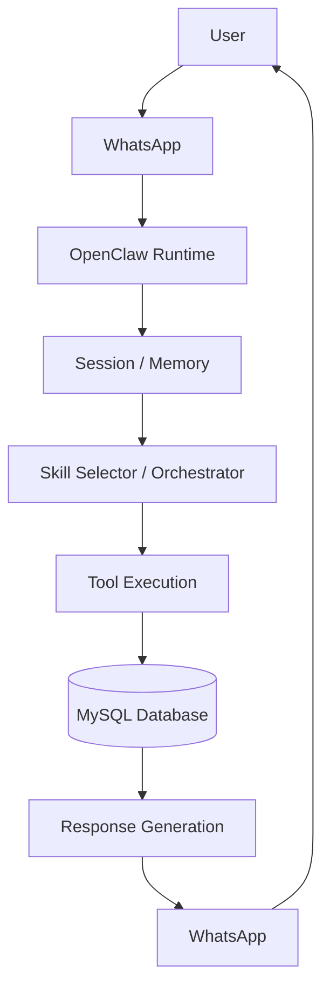

# Week 1: OpenClaw Architecture Fundamentals

## Project Overview

This project uses OpenClaw as the core runtime for a multi-agent real estate assistant. The system will receive user requests through WhatsApp, route the request to the correct skill or agent, access MLS data stored in MySQL, update session memory, and return a response to the user.

## Architecture Flow


## Key OpenClaw Components

### Skills
Skills are modular capability units that perform specific tasks. Examples in this project include property search, market statistics, recommendations, and RAG-based knowledge retrieval.

### Channels
Channels are communication interfaces between users and OpenClaw. This project currently uses WhatsApp as the main communication channel.

### Sessions
Sessions maintain conversation state for each user. They allow the system to remember previous messages and support multi-turn conversations.

### Tools
Tools are functions that agents can call to perform actions. In this project, tools will be used to query the MLS databases and return structured property or market data.

### Memory
Memory stores short-term session context and can later support longer-term information storage. It helps the assistant understand follow-up questions and maintain conversation continuity.

### Orchestrator
The orchestrator determines which skill or agent should handle a user request. It routes requests to the appropriate component and combines results when multiple agents are needed.

## MLS Database Integration

The project uses two MySQL tables inside the `idx_exchange` database.

### `rets_property`
This table contains active MLS property listings. It will primarily support property search and discovery.

### `california_sold`
This table contains historical sold and closed transactions. It will primarily support market statistics, comparable sales, and trend analysis.

## Detailed Workflow

A user sends a message through WhatsApp.

OpenClaw receives the message through the WhatsApp channel and associates it with the user's session.

The runtime passes the message to the orchestrator or skill selector.

The appropriate skill or agent is selected based on the request.

If data is needed, a tool sends a query to either `rets_property`, `california_sold`, or both.

The result is returned to the agent.

Session memory is updated so later follow-up questions can use the previous conversation context.

The response is formatted and sent back to the user through WhatsApp.

## Basic Tool Example

```ts
export async function getCurrentTime() {
  return { currentTime: new Date().toISOString() };
}

export async function handleMessage(message: string) {
  if (message.toLowerCase().includes("time")) {
    return await getCurrentTime();
  }

  return { response: "I could not understand the request." };
}
```

## Week 1 Deliverable

This document describes how user requests flow from WhatsApp through OpenClaw components and eventually reach the MLS databases before a response is returned to the user.
